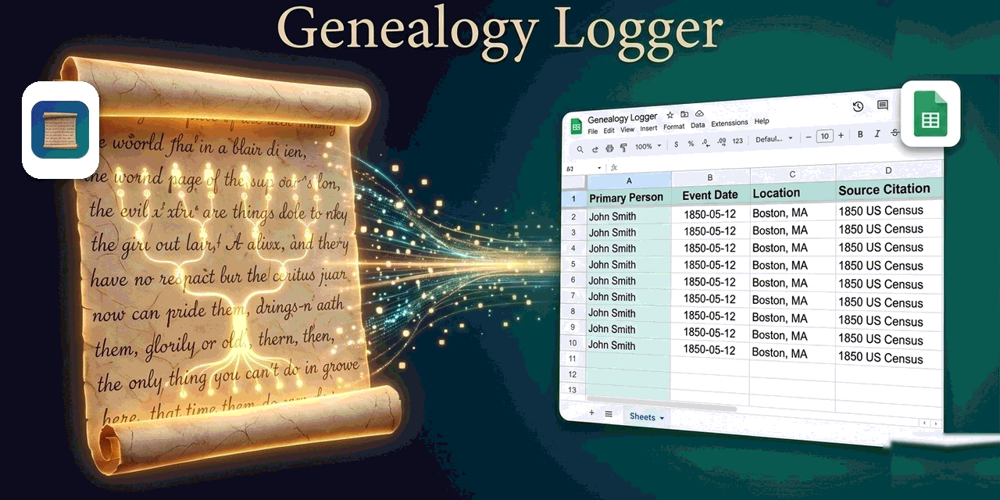

# 📜 Genealogy Logger - Chrome Extension

Log genealogical records from FamilySearch, MyHeritage, GenealogyBank, Find a Grave, Chronicling America, NARA, BLM Land Records, Internet Archive, and more directly into Google Sheets using Google Gemini.

---

## ⚡ Quick 3-Step Setup for Beginners

### Step 1: Install in Google Chrome (30 seconds)
1. Download and unzip `Genealogy-Logger.zip` on your computer.
2. In Google Chrome, navigate to `chrome://extensions` in your address bar.
3. Turn on the **Developer mode** toggle in the top-right corner.
4. Click **Load unpacked** (top-left) and choose the `Genealogy-Logger` folder.
5. The extension settings page will automatically open!

---

### Step 2: Set Up Your Google Sheet (2 minutes)
1. Open or create a Google Sheet at [sheets.new](https://sheets.new).
2. In the top menu, go to **Extensions > Apps Script**.
3. Replace the existing code with the contents of `google-sheets-script/Code.gs` (or click **Copy Script Code** on the extension settings page).
4. Click the gear icon (**Project Settings**) and tick **"Show 'appsscript.json' manifest file in editor"**, then replace that file's contents with `google-sheets-script/appsscript.json`. This declares the OAuth scopes the script needs.
5. Back in the editor, pick **`forceAuth`** in the function dropdown and click **Run**. Approve the prompt (**Advanced > Go to ... (unsafe) > Allow**). Check the execution log — it prints the account that just authorized.
6. Click **Deploy > New deployment**.
7. Select type: **Web app**:
   - **Execute as**: `Me (your email)` — must be the same account from step 5
   - **Who has access**: `Anyone`
8. Click **Deploy** and copy the **Web app URL**.
9. Paste this URL into the extension's settings page, and paste your **Google Sheet's URL** into the "Google Sheet URL" field there so the script knows where to write.

> **"You do not have permission to call UrlFetchApp.fetch"?** The script never got the `script.external_request` scope. Redo steps 4–5 — and confirm the account in the step 5 log is the same one you deployed with, since a web app runs as whoever deployed it.

---

### Step 3: Get Your Free Google Gemini API Key (60 seconds)
1. Go to [Google AI Studio](https://aistudio.google.com/app/apikey) and sign in with your Google account.
2. Click **Create API key**.
3. Copy your key (starts with `AIzaSy...`).
4. Paste it into **Step 1** on the extension settings page and click **Save Settings**.

---

## 🚀 How to Use

When viewing any historical document or record online:

| Method | How to Trigger |
| :--- | :--- |
| **Toolbar Button** | Click the 📜 extension icon to preview the page, add notes, and send |
| **Keyboard Shortcut** | Press <kbd>⌘+Shift+L</kbd> (Mac) or <kbd>Ctrl+Shift+L</kbd> (Windows) to open the same preview |
| **Right-Click** | Right-click the page and choose **Log this page to Genealogy Logger** to log it immediately, without the preview |

---

## 🏛️ Supported Websites

- **FamilySearch**: Record details, names, dates, places, family relationships, citations.
- **MyHeritage**: Record summary tables, collections, citations.
- **GenealogyBank**: Newspaper titles, issue dates, clipping snippets.
- **Find a Grave**: Memorial IDs, vitals, cemetery name, GPS, linked relatives.
- **Chronicling America (Library of Congress)**: Historic newspaper title, date, location, page #, OCR text.
- **National Archives Catalog (NARA)**: NAIDs, Record Groups, date spans, scopes.
- **BLM GLO Land Records**: Federal land patents, legal land descriptions, accession numbers.
- **Internet Archive**: Digitized books, authors, years, reader page numbers.
- **WikiTree & BillionGraves**: Profiles, headstone GPS coordinates, source citations.
- **Any webpage**: Extracts JSON-LD schema, headings, meta tags, and any highlighted text!
